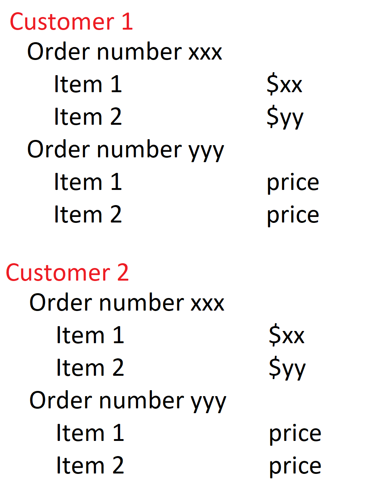

# Day 5 notes

# Hashed Data structures
A hashed Data structure is characterized by having O(1) access time for finding an element. It's very useful in exercises like this one:

https://www.codewars.com/kata/difference-between-two-collections/train/javascript

Given the following Objects, create a page that displays a table with order listings as in the image:



```javascript
  var customers = [
    {first_name: "John", last_name: "Doe", email: "thugnificent@fvi.edu", id: 12345},
    {first_name: "Jane", last_name: "McGall", email: "jane@fvi.edu", id: 12346},
    {first_name: "Adam", last_name: "Smith", email: "asmith@fvi.edu", id: 12347}
  ];

  var orders = [
    {order_id: 123, customer_id:12345, items: [1,2] },
    {order_id: 124, customer_id:12345, items: [2,3] },
    {order_id: 125, customer_id:12346, items: [1] },
    {order_id: 126, customer_id:12346, items: [2] },
    {order_id: 127, customer_id:12347, items: [1,2,3]},
  ];

  var inventory = [
    {item_id: 1, name: "Alligator Mask", price: 55 },
    {item_id: 2, name: "Japanese Weird Video Game", price: 77 },
    {item_id: 3, name: "Dragon Ball Z full body tattoo", price: 99 },
  ]
```

# Searching an Array

```javascript
  var a = [1, 2, 3, 4, 5, 6, 88, 99];

  function findInArray(arr, e){
     for (var i = 0; i < arr.length; i++){
  	if (arr[i] === e) return true;
     }
     return false;
  }

  findInArray([1, 2, 3, 4, 5, 6, 88, 99], 88)
  findInArray(a, 9001)
```

## Binary Search

```javascript
  function binSearch(arr, e){
     var lo = 0;
     var hi = arr.length-1;
     var mid;
     while ( lo <= hi){
       mid = Math.floor( lo + (hi-lo)/2 );
       console.log(mid, lo, hi);
       if (arr[mid] === e) return true;
       else if (e > arr[mid]) lo = mid + 1;
       else hi = mid -1;

     }
     return false;
  }
```

## SORTING an ARRAY

sort([3,4,0,5,1]) -> [0,1,3,4,5]
Bubble sort:

function bubbleSort(arr){
   for (var i =0 ; i < arr.length-1; i++){
     for (var j = 0; j < arr.length-1; j++){
	if (arr[j] > arr[j+1]){
	   var temp = arr[j];
	   arr[j] = arr[j+1];
	   arr[j+1] = temp;
        }
     }
   }
   return arr;
}

## Merge Sort

Steps:
1- split array in 2
2- mergesort left half
3- mergesort right half
4- Join the two arrays

```javascript
function merge(arr1, arr2){
   var lhs = 0;
   var rhs = 0;
   var result = [];
   while (result.length < arr1.length + arr2.length){
	if (arr1[lhs] <= arr2[rhs] || arr2[rhs] === undefined){
	   result.push(arr1[lhs]);
	   lhs++;
	}
	else{
	   result.push(arr2[rhs]);
	   rhs++;
	}
   }
   return result;
}

function mergeSort(arr){
   if (arr.length <= 1) return arr;
   var mid = Math.floor(arr.length/2);
   var left = arr.slice(0, mid);
   var right = arr.slice(mid);
   return merge(mergeSort(left), mergeSort(right));
}
```
